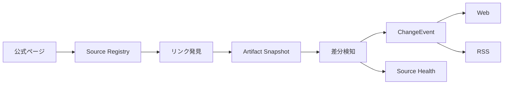
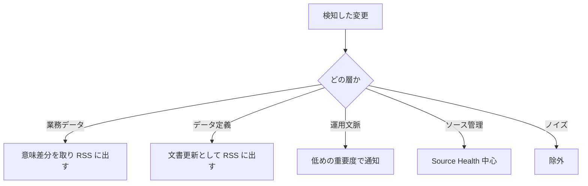

# Chitan Watch 情報範囲定義

> モード: full-advisory
>
> 対象読者: Chitan Watch の監視対象を設計する人、地単公費まわりの情報構造にまだ慣れていない人
>
> この記事で決めること: Chitan Watch が扱うべき情報の種類、扱わない情報、検知と通知の粒度、次の実装で守る境界

## 先に結論

Chitan Watch は、地単公費マスター CSV だけを見るプロダクトではない。公費制度の運用に必要な情報は、マスター本体、項目定義、入力要領、FAQ、入力例、委託状況、厚労省資料、支払基金の制度ページに分かれている。

現在の production workflow は `master_csv` だけに絞っているため、情報範囲としては不足している。これは MVP の細い入口であり、完成形ではない。

次の設計では、情報を「意味差分を取るもの」「ファイル更新を通知するもの」「文脈として表示するもの」「ノイズとして除外するもの」に分ける。全部を同じ重要度で RSS に流すと、利用者は何を見ればよいか分からなくなる。

## 現状の事実

### 本番 workflow は CSV 一件に絞っている

`.github/workflows/publish-static.yml:57` から `.github/workflows/publish-static.yml:61` では、支払基金の `titansys` ページをクロールしている。ただし `--artifact-type master_csv` が指定されているため、production の RSS とサイトは CSV だけを監視対象にしている。

```text
python3 -m chitan_watch.cli run-official-local https://www.ssk.or.jp/seikyushiharai/titansys/index.html --artifact-type master_csv
```

### 実装モデルは複数種類の資料を想定している

`crawler/chitan_watch/models.py:12` から `crawler/chitan_watch/models.py:22` には、CSV だけでなく Excel、項目定義、入力要領、マニュアル、入力例、FAQ、厚労省資料、HTML、その他が定義されている。

`crawler/chitan_watch/live_crawl.py:13` から `crawler/chitan_watch/live_crawl.py:14` では、実行側の既定値として `master_csv`、`master_excel`、`schema` が置かれている。production workflow はこの既定値よりさらに狭い。

### イベント生成にも未完成な境界がある

`crawler/chitan_watch/change_events.py:336` から `crawler/chitan_watch/change_events.py:350` では、master diff が存在すると master row events を作り、そうでない場合だけ artifact events を作る。つまり、マスター行差分と文書更新を同じ run で両方通知する設計になっていない。

## 公式ページから見える情報の種類

2026-08-09 時点で、支払基金の地単公費マスター関連ページを確認すると、少なくとも次の情報が見える。公式ページには、地単公費マスターは現物給付の制度を対象とし、償還払いの制度は含まれない旨が書かれている。自治体が新規制度を開始または既存制度を変更する場合は、原則として変更6か月前の月末までに Web フォームで更新対応する説明もある。

| 区分 | 例 | 役割 | 初期扱い |
|---|---|---|---|
| マスター本体 | 地単公費マスター確定事業一覧 CSV | システム取込や行差分の中心 | 意味差分と RSS 通知 |
| 代替形式 | 同 Excel | 人の確認や CSV 不具合時の照合 | ファイル更新検知、CSV との整合確認 |
| 項目定義 | 地単公費マスター項目一覧 PDF | CSV 列の意味を決める | schema change として通知 |
| 入力要領 | 地単公費マスター項目入力要領 PDF | 各項目の入力ルール | document change として通知 |
| 入力例 | 地単公費マスター入力例 PDF | 制度登録の具体例 | document change として通知 |
| FAQ | FAQ PDF | 運用上の疑問と回答 | document change として通知 |
| 基本説明 | 地単公費マスターの整備について PDF | 制度整備の背景 | 文脈更新として通知 |
| 委託状況 | 地単公費の請求事務の各自治体の委託状況 PDF | 現物給付や委託範囲の把握 | document change として通知 |
| 厚労省資料 | 国公費・地単公費マスタの変更・更新関連ページ | 政策文脈、説明会資料 | curated reference として監視 |
| 受託状況 | 支払基金が受託している医療費助成事業 | 都道府県別、事業種別、受託変更の把握 | 重要な運用文脈として監視 |
| 支払基金制度ページ | 地方単独医療費助成事業関連情報 | 制度全体の入口 | source page として監視 |
| 自治体公式ページ | 条例、要綱、告知、制度説明 | マスター差分の裏取り候補 | curated source として段階導入 |
| Web フォーム | 地単公費マスター事業情報登録システム | 登録・変更の操作入口 | ログイン内は監視対象外、公開説明のみ文脈化 |
| HTML ナビゲーション | サイトトップ、サイトマップ、関連サイト | クロール時に混ざるノイズ | 初期は除外 |

## 情報範囲の決定

Chitan Watch の対象情報は、次の四層に分ける。

### Layer 1 業務データ

業務システムや請求実務に直接入るデータ。CSV と Excel の確定事業一覧がここに入る。

扱い方は、ファイルの追加・削除・更新を検知し、CSV については行単位の意味差分を取る。RSS と Changes に出す。Excel は初期段階ではファイル更新と CSV 照合の補助に使い、Excel 自体を正とする意味差分は後続で決める。

### Layer 2 データ定義

CSV の列や入力値の意味を決める資料。項目一覧、入力要領、入力例がここに入る。

扱い方は、ファイル更新を検知し、Schema または Document 変更として RSS と Changes に出す。本文差分の抽出は後続でよいが、更新を Source Health だけに閉じ込めてはいけない。列定義が変わると、CSV パーサや業務解釈が変わるためだ。

### Layer 3 運用文脈

FAQ、基本説明、委託状況、現物給付化の説明会資料がここに入る。

扱い方は、Document 変更として通知する。ただし severity は原則 LOW または INFO から始める。文書が更新された事実と、マスター更新が必要な事実を混ぜない。

### Layer 4 公式裏取り情報

自治体公式ページ、条例、要綱、支払基金の受託状況がここに入る。

扱い方は、まず curated source として登録し、マスター差分の裏取りや影響範囲の補助に使う。自治体ページは数が多く形式もばらつくため、初期から全自治体を広域クロールしない。公式性、対象制度、更新履歴、機械的取得可能性を満たすものから段階的に入れる。

### Layer 5 ソース管理情報

公式ページそのもの、リンク一覧、取得失敗、HTTP メタデータ、ハッシュ、最終確認日時がここに入る。

扱い方は、Source Health に必ず出す。RSS に出すのは、取得失敗、重要リンクの追加・削除、監視対象ファイルの消失に限る。サイト内ナビゲーション HTML は監視対象ではなく、クロール上のノイズとして除外する。

## 初期スコープと対象外

| 判定 | 情報 | 理由 |
|---|---|---|
| 対象 | 支払基金 `titansys` ページの CSV | 現在の中核データ |
| 対象 | 同 Excel | CSV の代替形式、照合対象 |
| 対象 | 項目一覧 PDF | CSV 構造の根拠 |
| 対象 | 入力要領 PDF | データ項目の運用ルール |
| 対象 | 入力例 PDF | 初学者とレビュー担当の確認材料 |
| 対象 | FAQ PDF | 運用変更の早期検知に必要 |
| 対象 | 委託状況 PDF | 自治体・現物給付の文脈に関係する |
| 対象 | 厚労省の地単公費関連ページ | 政策文脈と説明会資料の更新を知るため |
| 対象 | 支払基金の受託状況ページ | 自治体・事業種別の受託状況がマスター差分の背景になるため |
| 対象 | 支払基金の地方単独医療費助成事業関連情報ページ | 制度全体の入口 |
| 段階導入 | 各自治体の個別ページ | 公式裏取りとして価値は高いが、正規ソース選定が必要 |
| 保留 | ベンダー資料、ブログ、二次解説 | 公式根拠ではない |
| 除外 | 支払基金サイトのグローバルナビ HTML | 地単公費更新とは関係しない |
| 除外 | サイトマップ、関連サイト、トップページ | クロールノイズになりやすい |

## 検知と通知の設計ルール

| 変更種別 | 検知 | RSS | Web 表示 | Review |
|---|---|---|---|---|
| CSV 行追加 | 行差分 | 出す | Changes、Detail、Master | 条件付き |
| CSV 行変更 | 行差分 | 出す | Changes、Detail、Master | 条件付き |
| CSV 行削除 | 行差分 | 出す | Changes、Detail、Master | 必要 |
| Excel 更新 | ハッシュ差分 | 出す | Changes、Source Health | 必要に応じる |
| 項目一覧更新 | ハッシュ差分、将来は PDF 差分 | 出す | Changes、Source Health | 必要 |
| 入力要領更新 | ハッシュ差分、将来は PDF 差分 | 出す | Changes、Source Health | 必要に応じる |
| FAQ 更新 | ハッシュ差分、将来は PDF 差分 | 出す | Changes、Source Health | 原則不要 |
| 委託状況更新 | ハッシュ差分、将来は PDF 差分 | 出す | Changes、Source Health | 必要に応じる |
| 公式ページのリンク追加 | リンク差分 | 重要リンクのみ出す | Source Health | 必要に応じる |
| 取得失敗 | HTTP/取得エラー | 出す | Source Health | 必要 |
| 受託状況更新 | ファイルまたはページ差分 | 重要変化のみ出す | Changes、Source Health | 必要に応じる |
| 自治体公式ページ更新 | curated URL の差分 | 初期は出さない | Source Health、Detail の根拠候補 | 必要 |
| ナビゲーション HTML 変化 | 取らない | 出さない | 出さない | 不要 |

## データ構造として持つべきもの

Source Registry が必要になる。今のように seed URL と artifact type だけで運用すると、公式ページに混ざるナビゲーションリンクと監視対象資料を区別できない。

Source Registry には次の属性を持たせる。

| 属性 | 意味 |
|---|---|
| source_group | master, schema, operation, policy, health など |
| source_url | 公式ページまたはファイル URL |
| owner | ssk, mhlw, municipality など |
| artifact_type | master_csv, schema, faq など |
| monitor_mode | semantic_diff, file_hash, link_presence, source_health |
| notify_policy | always, important_only, health_only, never |
| review_policy | required, conditional, none |
| evidence_level | confirmed, unresolved など |
| freshness_sla | どの頻度で確認するか |

## データフロー





## 次の実装前に守ること

1 CSV の監視を広げるだけでは足りない。先に Source Registry を作り、監視対象とノイズを区別する。

RSS は全部を流す場所ではない。CSV 行差分、定義資料更新、運用資料更新、取得失敗を区別して、件名と本文で「これは何の変更か」を分かるようにする。

`build_change_event_bundle` は、master diff がある時でも artifact/document change を捨てない形に直す。CSV 行差分と項目一覧 PDF 更新は同じ run で同時に存在しうる。

Guide と Source Health には、現在監視している source group と、まだ監視していない範囲を出す。利用者に「このサイトが世界全体を見ている」と誤解させない。

## 検証が必要な点

- 支払基金の `titansys` ページ、地方単独医療費助成事業関連情報ページ、受託状況ページをどう source group として分けるか。
- 厚労省ページをどこまで直接監視対象にするか。
- 自治体ごとの個別制度ページを対象に入れる場合、条例、要綱、制度案内、更新履歴のどれを primary source として扱うか。
- Excel と CSV の差分が食い違ったとき、どちらを primary とするか。
- PDF の本文差分を初期から取るか、まずはハッシュ差分だけにするか。

## 関連ファイル

| ファイル | 役割 |
|---|---|
| `.github/workflows/publish-static.yml:57` | production crawl の入口 |
| `.github/workflows/publish-static.yml:61` | `master_csv` だけに絞っている箇所 |
| `crawler/chitan_watch/models.py:12` | ArtifactType の定義 |
| `crawler/chitan_watch/live_crawl.py:13` | 許可ドメインの既定値 |
| `crawler/chitan_watch/live_crawl.py:14` | crawler の既定 artifact type |
| `crawler/chitan_watch/change_events.py:336` | ChangeEvent 生成の入口 |
| `crawler/chitan_watch/change_events.py:340` | master diff が artifact events に優先する箇所 |

## 情報源

- 社会保険診療報酬支払基金 地単公費マスター関連ページ: https://www.ssk.or.jp/seikyushiharai/titansys/index.html
- 社会保険診療報酬支払基金 地方単独医療費助成事業関連情報: https://www.ssk.or.jp/seikyushiharai/chitan/chitan_01.html
- 社会保険診療報酬支払基金 支払基金が受託している医療費助成事業: https://www.ssk.or.jp/seikyushiharai/chitan/jutaku/index.html
- 厚生労働省 国公費・地単公費マスタの変更・更新、地単公費の現物給付化の取組について: https://www.mhlw.go.jp/stf/seisakunitsuite/bunya/kenkou_iryou/iryouhoken/index_00030.html
- 診療報酬情報提供サービス: https://shinryohoshu.mhlw.go.jp/shinryohoshu/
