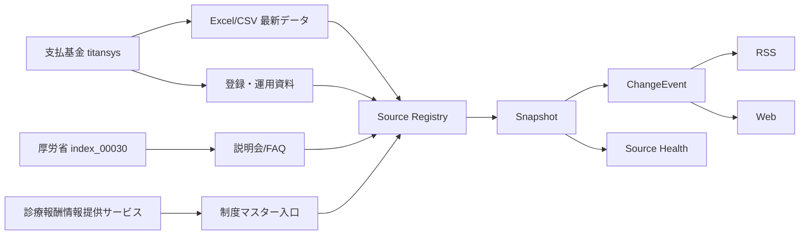

# Chitan Watch 情報範囲定義

> モード: full-advisory
>
> 対象読者: Chitan Watch の監視対象を設計する人、地単公費マスターの外部更新を追う担当者
>
> この記事で決めること: 支払基金・厚労省側の地単公費マスターをどう見るか、何が対象か、何を watch するか

## 先に結論

今回の Chitan Watch MVP は、外部サイト上の地単公費マスター更新を追うことに絞る。中心は支払基金の「地単公費マスター情報の登録に関するお知らせ」であり、ここに置かれる「地単公費マスター確定事業一覧」の Excel / CSV が実データの取得元である。

補助的に、厚労省の「国公費・地単公費マスターの変更・更新、地単公費の現物給付化の取組について」で制度背景、説明会、FAQ を見る。診療報酬情報提供サービスの「公費負担医療制度マスター」は、国公費マスター・地単公費マスターの位置づけと支払基金ページへの導線を見る入口として扱う。実ファイルの取得元、制度背景、制度マスター入口を分けて読む。

PMH や自治体個別ページは重要な隣接領域だが、この slice の active RSS/watch 対象ではない。自治体制度全体の網羅ではなく、支払基金・厚労省側の地単公費マスター更新を追う。

## まず見る外部ページ

| 優先 | ページ | 役割 | watch 対象 |
|---|---|---|---|
| 1 | 支払基金 地単公費マスター情報の登録に関するお知らせ | 実データのダウンロード元 | 最新データの基準日、Excel/CSV リンク、ファイル名、ファイルサイズ、CSV差分 |
| 2 | 厚労省 国公費・地単公費マスターの変更・更新、現物給付化の取組 | 制度背景、説明会資料、FAQ の入口 | 説明会資料追加、FAQ更新、対象範囲や登録運用の記述変更 |
| 3 | 診療報酬情報提供サービス 公費負担医療制度マスター | 公費負担医療制度マスター側の入口 | 国公費/地単公費マスターの位置づけ、支払基金ページへの導線 |
| 補助 | 支払基金トップ更新情報 | 更新情報に出るかの補助確認 | health-only。更新有無の本命判断には使わない |

## 地単公費マスターの対象

支払基金ページの説明に基づくと、地単公費マスターは、地方公共団体の医療費等助成事業に係る制度をまとめたマスターである。受給者証の券面記載事項の要件を適用し、患者負担金を計算できるように作成されている。

対象は、各自治体の制度のうち、併用レセプトまたは連記式医療費明細書による現物給付の制度である。償還払い制度は含まれない。

つまり、このマスターは「自治体の医療費助成制度を全部網羅した制度カタログ」ではない。レセコン、医事会計システム等で現物給付の患者負担金計算に使うためのマスターとして見る。

## ダウンロードデータの見方

支払基金ページでは、最新版が次のような形式で掲載される。

- 地単公費マスター確定事業一覧（令和X年X月X日時点）（Excel）
- 地単公費マスター確定事業一覧（令和X年X月X日時点）（CSV UTF-8）

watch で最初に見るのは、リンク文言とファイル名に含まれる「何日時点」かである。CSV ファイル名では `m_regional_publicly_funded_all_YYYYMMDD.csv` の日付部分が大きな手がかりになる。

人間の確認は Excel が向く。差分検知や自動処理は CSV が向く。Chitan Watch では、リンク文言、ファイル名、ファイルサイズ、ハッシュ、CSV の中身の差分を追う。通知日、ファイル基準日、制度施行日は別の概念なので、RSS ではどの層の変化かを先に見る。

「確定事業一覧」は、暫定的な入力フォームや説明資料ではなく、公開されているデータ本体として扱う。ただし、医事会計システムやレセコンで使う場合は、同値性テストなど必要な検証を実施した上で利用する。公開 CSV をそのまま正として本番反映する設計にはしない。

## 更新観点

| 観点 | 何を見るか | 通知方針 |
|---|---|---|
| 最新データの基準日 | 「令和X年X月X日時点」、CSV/Excel ファイル名の日付 | RSS に出す |
| CSV/Excel ファイル | ファイル追加、削除、更新、サイズ、ハッシュ | RSS に出す |
| CSV 行差分 | 公費負担者番号、自治体、制度名、適用期間、分類など | RSS と Detail に出す |
| 登録・変更・廃止運用 | Web フォーム、変更6か月前の月末までの更新対応、通知日・ファイル基準日・制度施行日の区別 | 運用資料更新として出す |
| 厚労省説明会・FAQ | 全国説明会、自治体向け説明会、実態調査、よくある質問 | policy-faq として出す |
| 支払基金トップ更新情報 | titansys 更新がトップに出るか | health-only。補助確認に留める |

RSS は、公式ページや公開ファイルの変化を知らせる入口である。制度変更の確定判断、本番マスター反映、ベンダー作業指示を自動で意味しない。Severity は確認優先度、Review は人の確認要否、確度は根拠の強さ、health-only は取得状態の補助確認として扱う。

## Source Registry のレイヤー

| source_layer | 内容 | 例 |
|---|---|---|
| `master-latest-data` | 確定事業一覧 Excel / CSV と基準日 | 支払基金 titansys の最新データ |
| `master-registration-operation` | 登録、変更、廃止、項目一覧、入力要領、入力例、FAQ、検証前提 | 支払基金 titansys の PDF 群 |
| `policy-faq` | 制度背景、説明会、FAQ、自治体向け説明 | 厚労省 `index_00030` |
| `reference-portal` | 公費負担医療制度マスターの入口と導線 | 診療報酬情報提供サービス |
| `site-news-health` | 支払基金トップ更新情報の補助確認 | 支払基金トップ |

## 対象外を見るときの注意

地単公費マスターに載っていないからといって、自治体制度が存在しないとは限らない。特に次を分けて見る。

- 償還払い制度は含まれない。
- 自治体独自制度でも、現物給付・併用レセプト・連記式医療費明細書の枠に入らないものは対象外になり得る。
- 自治体側の登録状況や委託状況によって、掲載や反映に差が出る可能性がある。
- 医事会計システムで使う場合は、同値性テストなどの検証が必要である。

## 実装境界

## 情報源

- 社会保険診療報酬支払基金 地単公費マスター情報の登録に関するお知らせ: https://www.ssk.or.jp/seikyushiharai/titansys/index.html
- 厚生労働省 国公費・地単公費マスターの変更・更新、地単公費の現物給付化の取組について: https://www.mhlw.go.jp/stf/seisakunitsuite/bunya/kenkou_iryou/iryouhoken/index_00030.html
- 診療報酬情報提供サービス 公費負担医療制度マスター: https://shinryohoshu.mhlw.go.jp/shinryohoshu/html/seido_master.jsp
- 社会保険診療報酬支払基金トップ: https://www.ssk.or.jp/
