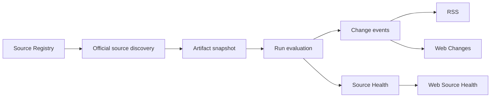
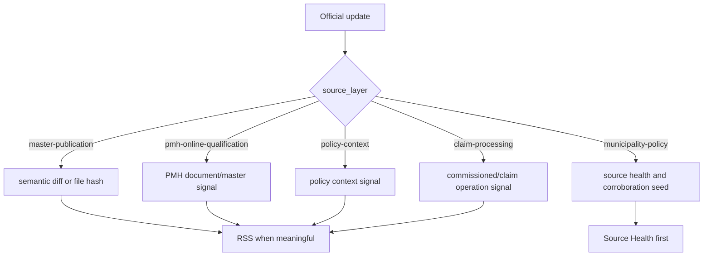

# Chitan Watch 情報範囲定義

> モード: full-advisory
>
> 対象読者: Chitan Watch の監視対象を設計する人、地単公費/医療費助成/PMH まわりの情報構造にまだ慣れていない人
>
> この記事で決めること: どの公式情報をどの役割で見るか、支払基金をどこに位置付けるか、MVP の監視対象と通知境界

## 先に結論

支払基金の地単公費マスター関連ページは重要だが、Chitan Watch 全体の「唯一の正」ではない。支払基金は主に地単公費マスター公開、登録運用資料、受託状況を確認する層であり、制度全体は PMH、診療報酬情報提供サービス、厚労省、審査支払機関、自治体個別ページに分散している。

したがって Chitan Watch は、単一ページ監視ではなく Source Registry による多層監視として設計する。各ソースには `source_layer`、`source_owner`、`source_role`、`jurisdiction_scope`、`monitor_mode`、`notify_policy` を持たせる。

RSS は全監視対象をそのまま流す場所ではない。マスター、定義資料、PMH/資格確認、請求運用、自治体制度のどの層かが読める通知だけを流し、seed の健全性確認や自治体ページの初期裏取りは Source Health 中心に置く。

## 問題の本質

地単公費は「CSV が更新されたら終わり」という問題ではない。制度は自治体が持ち、医療機関やシステムで扱うためにマスター化され、オンライン資格確認/PMH の導入状況と接続し、審査支払機関の委託・請求運用に流れ込む。どの層の更新かを分けない通知は、利用者にとって意味のないノイズになる。

以前の設計は、支払基金の `titansys` ページを広げた点は一歩前進だったが、まだ「支払基金周辺で完結する」という暗黙の偏りが残っていた。これは正しくない。

## 公式情報レイヤー

| source_layer | 主な owner | 何を見るか | 例 | 初期扱い |
|---|---|---|---|---|
| `policy-context` | 厚労省、支払基金 | 制度背景、政策文脈、説明会、地単公費マスタ変更・更新の考え方 | 厚労省の国公費・地単公費マスタ関連ページ、支払基金の地方単独医療費助成事業関連情報 | Source Health + 重要更新通知 |
| `pmh-online-qualification` | デジタル庁、厚労省 | PMH、マイナンバーカードによる医療費助成資格確認、参加自治体、制度関連マスタ、導入医療機関 | デジタル庁 Public Medical Hub、厚労省 医療費助成のオンライン資格確認 | Source Health + PMH 公開資料更新通知 |
| `master-publication` | 支払基金、診療報酬情報提供サービス | 地単公費マスター、制度マスター、項目一覧、入力要領、FAQ、CSV/Excel | 支払基金 `titansys`、診療報酬情報提供サービス 制度マスター | RSS 通知 + semantic diff |
| `claim-processing` | 支払基金、国保中央会/国保連系 | 受託状況、審査支払、請求事務、自治体別委託状態 | 支払基金が受託している医療費助成事業 | 重要更新通知 |
| `municipality-policy` | 自治体 | 制度の実体、対象者、受給者証、自己負担、現物給付/償還払い、条例・要綱 | 札幌市、横浜市、墨田区などの医療費助成ページ | 初期は Source Health 中心、裏取り seed |

## 支払基金の位置付け

支払基金は、地単公費マスター関連資料の公開元として強い一次情報である。確定事業一覧 CSV/Excel、項目一覧、入力要領、入力例、FAQ、委託状況などは、業務システムや請求運用に直結するため MVP の中核に置く。

ただし、自治体制度そのものを設計している主体ではない。PMH の参加自治体や制度関連マスタ、オンライン資格確認の医療機関向け情報、自治体の制度ページを支払基金ページの従属物として扱ってはいけない。

## Source Registry の設計

Source Registry は URL の羅列ではない。各ソースが何の根拠なのかを持つ。

| 属性 | 意味 |
|---|---|
| `source_group` | 画面でまとめる運用上のグループ |
| `source_layer` | policy、PMH、master、claim、municipality のような業務上の情報層 |
| `source_owner` | ssk、mhlw、digital-agency、shinryohoshu、municipality など |
| `source_role` | index、public-master-materials、pmh-master、municipality-benefit-rule-page など |
| `jurisdiction_scope` | national、national-by-prefecture、local など |
| `monitor_mode` | semantic_diff、file_hash、source_health、link_presence |
| `notify_policy` | always、important_only、health_only、never |
| `review_policy` | required、conditional、none |

## 通知ルール

| 対象 | RSS | 理由 |
|---|---|---|
| CSV 行差分 | 出す | 業務システムのマスター反映判断に直結する |
| CSV/Excel/項目一覧/入力要領/FAQ 更新 | 出す | データ定義や運用ルール変更の可能性がある |
| PMH 制度関連マスタ/参加自治体/医療機関導入状況 | 出す | 資格確認や医療機関運用に影響しうる |
| 支払基金/厚労省の政策ページ | 重要更新のみ | 背景情報だが即時作業命令ではない |
| 受託状況 | 重要更新のみ | 請求運用・委託範囲の変化に関係する |
| 自治体 seed ページ | 初期は Source Health 中心 | 全国網羅前に公式裏取りの型を作る段階 |
| 取得失敗 | 出す | 監視不能は運用上の異常だから |

`health_only` のソースは、取得失敗以外は RSS に出さない。画面の Source Health には出す。

## 現在の MVP 監視対象

- 支払基金 地単公費マスター関連ページ
- 支払基金 地単公費マスター CSV/Excel、項目一覧、入力要領、入力例、FAQ、委託状況
- 支払基金 地方単独医療費助成事業関連情報
- 支払基金が受託している医療費助成事業
- 厚労省 国公費・地単公費マスタの変更・更新関連ページ
- 厚労省 医療費助成のオンライン資格確認
- デジタル庁 Public Medical Hub
- デジタル庁 PMH 公開資料・制度関連マスタ候補
- 診療報酬情報提供サービス 制度マスター
- 自治体 seed: 札幌市、横浜市、墨田区の医療費助成ページ

これは全国完成形ではない。MVP の目的は「単一 CSV 監視」から脱し、情報層ごとに増やせる構造を作ることにある。

## 実装境界

## 検証が必要な点

- PMH の downloadable master/参加自治体/医療機関導入ファイルの本文構造を解析対象にするか。
- 国保中央会/国保連系の公式公開情報をどの URL で継続監視するか。
- 自治体 seed を全国に広げるための選定基準。条例、要綱、制度説明、更新履歴のどれを primary とするか。
- 支払基金 CSV と診療報酬情報提供サービスの制度マスターの対応関係。
- PDF/HTML の本文差分とリンク差分をどの段階で導入するか。

## 情報源

- 社会保険診療報酬支払基金 地単公費マスター関連ページ: https://www.ssk.or.jp/seikyushiharai/titansys/index.html
- 社会保険診療報酬支払基金 地方単独医療費助成事業関連情報: https://www.ssk.or.jp/seikyushiharai/chitan/chitan_01.html
- 社会保険診療報酬支払基金 支払基金が受託している医療費助成事業: https://www.ssk.or.jp/seikyushiharai/chitan/jutaku/index.html
- 厚生労働省 国公費・地単公費マスタの変更・更新、地単公費の現物給付化の取組について: https://www.mhlw.go.jp/stf/seisakunitsuite/bunya/kenkou_iryou/iryouhoken/index_00030.html
- 厚生労働省 医療費助成のオンライン資格確認: https://www.mhlw.go.jp/stf/seisakunitsuite/bunya/kenkou_iryou/iryou/iryouhijosei-iryoukikan.html
- デジタル庁 Public Medical Hub: https://www.digital.go.jp/policies/health/public-medical-hub
- 診療報酬情報提供サービス 制度マスター: https://shinryohoshu.mhlw.go.jp/shinryohoshu/html/seido_master.jsp
- 札幌市 子ども医療費助成: https://www.city.sapporo.jp/hoken-iryo/iryojosei/nyuyoji.html
- 横浜市 小児医療費助成: https://www.city.yokohama.lg.jp/kenko-iryo-fukushi/kenko-iryo/iryohijosei/shoni/child.html
- 墨田区 子ども医療費助成: https://www.city.sumida.lg.jp/kosodate_kyouiku/kosodate_site/teate_jyosei_shien/teate_zyosei/jyosei/nyuuyouji_iryouhi.html
